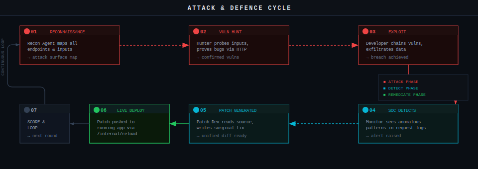

<!-- ------------------------------------------------------------------ -->
<!--  MATRIXGPT — Autonomous Adversarial Security War Game             -->
<!--  OpenAI Hackathon submission · Track: Multi-Agent Systems         -->
<!-- ------------------------------------------------------------------ -->

<div align="center">

<!-- TODO: Replace with your logo -->
<!--  -->

# MatrixGPT

**Autonomous Adversarial Security War Game**

AI Red Team agents attack. AI Blue Team agents defend. The war is live.

<br/>


</div>

---

## Demo

<!-- TODO: Replace with your demo video link -->
<!-- Recommended: unlisted YouTube link or a direct .mp4 hosted on GitHub releases -->

> **📹 Demo video** — *[placeholder — insert link here]*
>
> If the video doesn't embed, use this direct link: `[INSERT URL]`

<!-- Uncomment and fill once you have the video: -->
<!--
[](INSERT_VIDEO_URL)
-->

---

## What It Does

MatrixGPT is an autonomous adversarial security war simulator where one team of AI agents attacks to find and exploit vulnerabilities while the other defends in real time.

> Security as a live match: detect, defend, and score in real time.


---

## Attack & Defence Cycle



This seven-step loop repeats continuously for the duration of the battle. Steps 1–3 are the Red Team attack phase. Step 4 is Blue Team detection. Steps 5–6 are remediation. Step 7 scores the round and feeds back into the next iteration. When Blue Team patches a vulnerability, the same exploit vector genuinely stops working on the next Red Team attempt — judges can watch this happen in real time on the vulnerability board.

---

## Agent Roster

Each agent is a distinct `Agent(...)` instance in the OpenAI Agents SDK, equipped with specialised `@function_tool` decorated functions. Commanders use the **agents-as-tools** pattern to delegate to specialists.

### Red Team — Attack

| Agent | Role | Key Tools |
|---|---|---|
| **Red Team Commander** | Orchestrates attack phases. Narrates strategy in real time. | `recon_agent.as_tool()`, `vuln_hunter.as_tool()`, `exploit_dev.as_tool()` |
| **Recon Agent** | Maps every endpoint, input surface, and technology signal on the target. | `http_get`, `http_post` |
| **Vulnerability Hunter** | Probes discovered inputs with payloads. Proves each bug with a real HTTP round-trip. | `http_get`, `http_post` |
| **Exploit Developer** | Chains confirmed vulnerabilities into multi-step attack campaigns. Exfiltrates data. | `http_get`, `http_post` |

### Blue Team — Defence

| Agent | Role | Key Tools |
|---|---|---|
| **Blue Team Commander** | Orchestrates defence. Prioritises patches by severity. | `soc_monitor.as_tool()`, `patch_dev.as_tool()` |
| **SOC Monitor** | Polls request logs every 3 seconds. Classifies attack patterns (SQLi, XSS, brute-force, IDOR, SSRF). | `get_recent_logs` |
| **Patch Developer** | Reads the vulnerable source, writes a surgical unified-diff fix. | `get_source_file` |
| *(applied by Commander)* | Pushes the patch to the running Sample App via `/internal/reload`. | `apply_patch` |

### Neutral

| Agent | Role |
|---|---|
| **Game Master** | Scores events, enforces safety rules, detects battle-end conditions. Uses `gpt-4.1-mini` for low-latency scoring. |

---

## Planted Vulnerabilities (Sample App)

The Sample App ships with ten real, exploitable vulnerabilities. Every one can be triggered by an actual HTTP request — nothing is simulated.

| # | Type | Endpoint | Exploit Summary |
|---|---|---|---|
| 1 | **SQL Injection** | `GET /api/products?search=` | Direct string interpolation into SQL. `' UNION SELECT` dumps the users table. |
| 2 | **Stored XSS** | `POST /api/reviews` | Comment field stored and rendered raw. Script tags execute on page load. |
| 3 | **JWT Bypass** | `GET /api/admin/*` | Verification accepts `alg: none`. A signature-less token grants full admin access. |
| 4 | **IDOR** | `GET /api/orders/:id` | No ownership check. Any user can read any order by ID. |
| 5 | **Unrestricted File Upload** | `POST /api/users/avatar` | No extension validation. Uploaded `.html` files are served and execute scripts. |
| 6 | **SSRF** | `POST /api/image-proxy` | Fetches any URL server-side with no allowlist. Hits internal admin endpoints. |
| 7 | **Hardcoded Credentials** | Source code | Default `admin / admin123` in seed data. Internal API key in a source comment. |
| 8 | **Missing Rate Limit** | `POST /api/auth/login` | No throttling. Login brute-force is unrestricted. |
| 9 | **Information Disclosure** | All error routes | Full Python stack traces returned in JSON when errors occur. |
| 10 | **CSRF** | `POST /api/orders` | No token validation. Combined with XSS (#2), enables full account takeover. |

---

## Tech Stack

| Layer | Technology |
|---|---|
| Agent orchestration | OpenAI Agents SDK (`openai-agents`) |
| LLM | GPT-5.2-codex (agents) · GPT-5.2-codex (Game Master) |
| Backend | Python 3.11 · FastAPI · Uvicorn |
| Real-time transport | WebSockets (FastAPI native) |
| Frontend | React (CDN, no build step) · single `index.html` |
| Database | SQLite (zero-config, single file) |
| HTTP client | `httpx` (async) |

---

## How To Run

### Prerequisites

- Python 3.11+
- An OpenAI API key with access to GPT-5.2

### Local Development

Open **three terminals**:

```bash
# Terminal 1 — Sample App (the attack target)
cd sample-app
pip install -r requirements.txt
uvicorn app:app --host 0.0.0.0 --port 8001
```

```bash
# Terminal 2 — Orchestrator (agents + WebSocket server + frontend)
cd orchestrator
pip install -r requirements.txt
export OPENAI_API_KEY="sk-..."          # macOS / Linux
# set OPENAI_API_KEY=sk-...             # Windows
export TARGET_URL="http://localhost:8001"
uvicorn main:app --host 0.0.0.0 --port 8000
```

```bash
# Terminal 3 — Run the test suite
cd orchestrator
pip install pytest pytest-asyncio httpx -q
pytest tests/ -v
```

Once both servers are running, open **`http://localhost:8000`** in your browser.


---

## Demo Steps

1. Open the app in your browser. You will see the **pre-battle screen** with two options.
2. Click **"Use Sample App"**. This selects the built-in vulnerable target — no upload needed.
3. Click the **START BATTLE** button.
4. Watch the three-column dashboard:
   - **Left panel (Red Team):** Toggle between *Strategy* (high-level narration) and *Details* (raw HTTP calls) to see exactly what the attackers are doing.
   - **Centre panel (Battle Feed):** Every event in chronological order — attacks, detections, patches, score changes — colour-coded by team.
   - **Right panel (Blue Team):** Same toggle as Red. Watch SOC detect attacks and Patch Developer write fixes.
5. **Vulnerability Board** (bottom): Ten cards start grey (`UNKNOWN`). They transition to red when found/exploited, then green when patched. This is the scoreboard.
6. The battle runs for up to **10 minutes** or until all vulnerabilities are patched.
7. On battle end, the dashboard shows a **final report**: total attacks, successful exploits, patches applied, and time-to-detect / time-to-remediate metrics.
8. Click **REPLAY** to run another battle.

### Things to point out during a live demo

- Ask the audience to watch a specific vulnerability card — e.g. SQL Injection. When Red Team exploits it, the card glows red. Seconds later, Blue Team patches it and it turns green. The *next* Red Team attempt at that vector visibly fails.
- Toggle the Red Team panel to *Details* to show the raw HTTP requests the agents are sending — these are real network calls, not simulated.
- The agents adapt. If Blue Team patches a vector, Red Team's Commander narrates a pivot to a different attack surface.

---


### About the Project

> MatrixGPT is an autonomous adversarial security war game: AI Red Team agents attack a web application via real HTTP requests while AI Blue Team agents detect intrusions and deploy live code patches — all without human intervention. Built with OpenAI Agents SDK, 8 specialist agents per side coordinate attack chains, log analysis, and surgical vulnerability fixes in a continuous real-time loop visible through a military-style command-center dashboard.

### How We Used OpenAI Models, APIs & Tools

> We use GPT-4.1 for all 8 Red and Blue Team agents via the OpenAI Agents SDK, leveraging agents-as-tools orchestration for commander→specialist delegation and Runner.run_streamed() for real-time event streaming to our WebSocket frontend. GPT-4.1-mini powers the Game Master scorer for low-latency rule enforcement. All agent tool calls execute real HTTP requests and code patches — no simulation.

---

## How This Maps to Judging Criteria

| Criterion | How MatrixGPT addresses it |
|---|---|
| **Clarity of idea** | The problem (security testing is slow, static, and manual) and the solution (autonomous agents that attack and defend continuously) are stated in the first two sentences. The vulnerability board gives instant visual feedback on what's happening. |
| **Track alignment** | Core mechanic is purposeful multi-agent coordination: two commander agents delegate to specialists via agents-as-tools, specialists communicate findings back up the chain, and the two teams react to each other's actions in real time. This is adversarial collaboration — not parallel execution. |
| **Technical execution** | Every attack is a real HTTP request. Every patch is real code that changes the running application's behaviour. The test suite (`pytest tests/ -v`) verifies all ten vulnerabilities are exploitable and that patches actually close them. |
| **Completeness** | Full end-to-end flow: select target → battle runs autonomously → events stream to dashboard → battle ends → report generated. Nothing is mocked or hand-waved. |
| **Impact & insight** | Security testing is a $6B+ market. Traditional pen tests happen once a year. MatrixGPT demonstrates that autonomous adversarial agents can find, exploit, and fix vulnerabilities in minutes — continuously. The adversarial multi-agent pattern (two teams with competing objectives reacting to each other) is a novel application of the Agents SDK that showcases what becomes possible when agents aren't just cooperating but actively opposing. |

---

## Team

<!-- TODO: Fill in team details -->


| Name | LinkedIn |
|---|---|
| Vedanta Trivedi | [Profile](https://www.linkedin.com/in/vedantatrivedi/) |
| Jinit Shah | [Profile](https://www.linkedin.com/in/jinit24) |

---

*MatrixGPT — built in 48 hours for the OpenAI Hackathon.*
